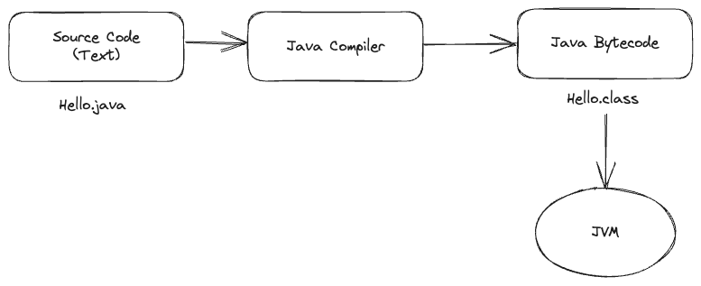
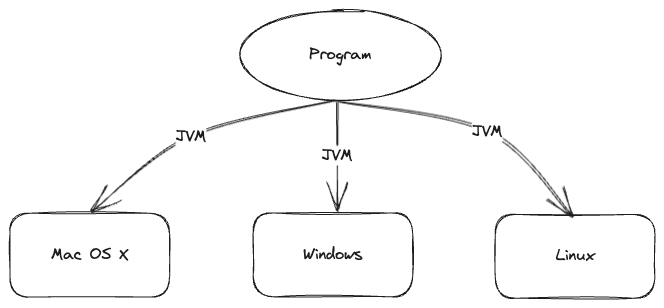
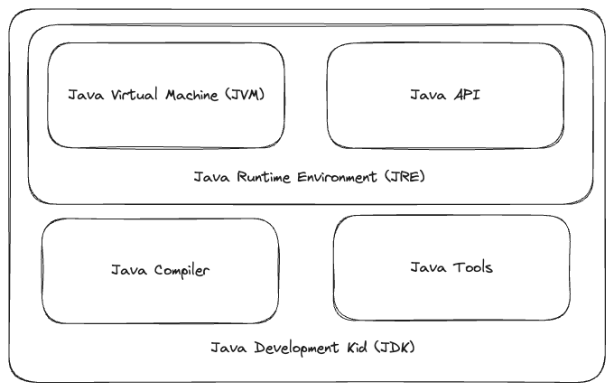

# Java SE

## What is Java?

- High Level Programming
- Object Oriented
- Strong Type Programming
- Write Once Run AnyWhere
- Desktop Applications
- Mobile Applications
- Enterprise Applications
- Embedded Applications
- Functional Style

## Writing Java



1. Source Code အားရေးသားခြင်း
2. Source Code အား compile လုပ်ခြင်း
3. Class file အား Java Virtual Machine(JVM) ပေါ်တွင် အလုပ်လုပ်စေခြင်း

## Write Once Run Anywhere



Java program တစ်ခုက JVM ရှိတဲ့ ဘယ် machine မှာမဆို အလုပ်လုပ်နိုင်ပါတယ်။

## Java Environment



## Java Editions

- Java SE
    - Java ဘာသာရပ်၏ အခြေခံ Edition
    - Desktop Application များအား ရေးသားနိုင်
- Java EE
    - Enterprise Java Application များအား ရေးသားရန် အခြေခံ Edition
- Java ME
    - Embedded ပတ်ဝန်းကျင်များ အတွက် Java Edition

## In This Course

- Java Basic
    - Language Fundamentals
        - Basic Structure of a Class
        - Java Data Types
        - Identifis and Madifiers
        - Statements
    - OOP
        - OOP
        - Class & Interfaces
        - Enum & Annotations
        - Generics
    - Essential API
        - Exceptions
        - Numbers
        - Strings
        - Date & Calendar
        - Collections
        - Java IO
        - Nio 2
        - Threads
        - Concurrency
    - Functional Style
        - Lambda Expression
        - Streams API
        - Functional Programming
        - Functional Interfaces
- Database
    - Relational Database
    - Data Modeling
    - Simple SQL
    - JDBC API
- GUI
    - Scene Graph
    - Layouts
    - Controls
    - Styles and Effects
    - Animations

## Basic Structure of a Class

### Write A Class

class တွေကနေ တစ်ဆင့် object တွေကို တည်ဆောင်ဖို့ class တွေကို ရေးသားတာဖြစ်ပါတယ်။

### Components

- Package statements
- Import statements
- Comments
- Class declaration {\
  &nbsp; &nbsp; &nbsp; &nbsp;Variables\
  &nbsp; &nbsp; &nbsp; &nbsp;Comments\
  &nbsp; &nbsp; &nbsp; &nbsp;Constructors\
  &nbsp; &nbsp; &nbsp; &nbsp;Methods\
  &nbsp; &nbsp; &nbsp; &nbsp;Nested classes\
  &nbsp; &nbsp; &nbsp; &nbsp;Nested Interface\
  &nbsp; &nbsp; &nbsp; &nbsp;Enum\
  \}

## Class Declaration

class declaration components

| Name       | Descriptions        | Status     |
|------------|---------------------|------------|
| public     | Access modifier     | Optional   |
| final      | Non-Access modifier | Optional   |
| class      | Keyword class       | Compulsory |
| Runner     | Name of class       | Compulsory |
| extends    | Keyword extends     | Optional   |
| Persons    | Base class name     | Optional   |
| implements | Keyword implements  | Optional   |
| Athlete    | Name of implements  | Optional   |
| {}         | Curly braces        | Compulsory |

## Running a Java Program

Java program တွေကို run မယ်ဆိုရင် `java` ဆိုတဲ့ command ကို သုံးပြီးတော့ run လို့ရပါတယ်။

```java
public class Person {
    public static void main(String[] args) {
        System.out.println("Hello World!");
    }
}
```

program ထဲမှာ run စေချင်တဲ့ code တွေကို main method ထဲမှာ ရေးရပါမယ်။

### How does work Args?

main method ထဲမှာပါလာတဲ့ args သည် java program ကို run တဲ့ အချိန်မှာ parameter အနေနဲ့ ပေးလိုက်တဲ့ value တွေကို args ကနေ
ပြန်ယူနိုင်ပါတယ်။

```java
public class Person {
    public static void main(String[] args) {
        for (String s : args) {
            System.out.println(s);
        }
    }
}
```

```bash
$ javac Person.java
$ java Person Hello
```

```bash
$ java Person Hello
``` 

ဒီနေရာမှာဆိုရင် hello ဆိုတဲ့ command သည် args သို့ value အဖြစ်နဲ့ ပေးတာဖြစ်ပါတယ်။

```bash
$ java Person Hello World
``` 

ဒီနေရာမှာဆိုရင်တော့ Hello World သည် line တစ်ခုစီဖြင့်ထွက်လာမှာပဲ ဖြစ်ပါတယ်။ ဘာဖြစ်လို့လဲ ဆိုတော့ Hello နဲ့ World ဆိုတဲ့
command နှစ်ခုကြားမှာ space ပါနေတဲ့အတွက်ကြောင့် command နှစ်ခုလို့ သတ်မှတ်တာဖြစ်တဲ့အတွက်ကြောင့် Hello အသည် line 1
နေရာမှာပေါ်ပြီးတော့ World အသည် line 2 ဖြင့် ဖေါ်ပြမှာပဲ ဖြစ်ပါတယ်။

```bash
$ java Person "Hello World"
```

ဒီလိုရေးမယ်ဆိုရင်တော့ "Hello World" သည် line တစ်ခုတည်းဖြင့်ထွက်လာမှာပဲ ဖြစ်ပါတယ်။ "" double quote ပါနေတဲ့အတွက်ကြောင့်
string ဖြစ်သတ်မှတ်ပြီးတော့ စာကြောင်းတစ်ကြောင့်တည်းမှာပဲ လာဖော်ပြတာပဲ ဖြစ်ပါတယ်။