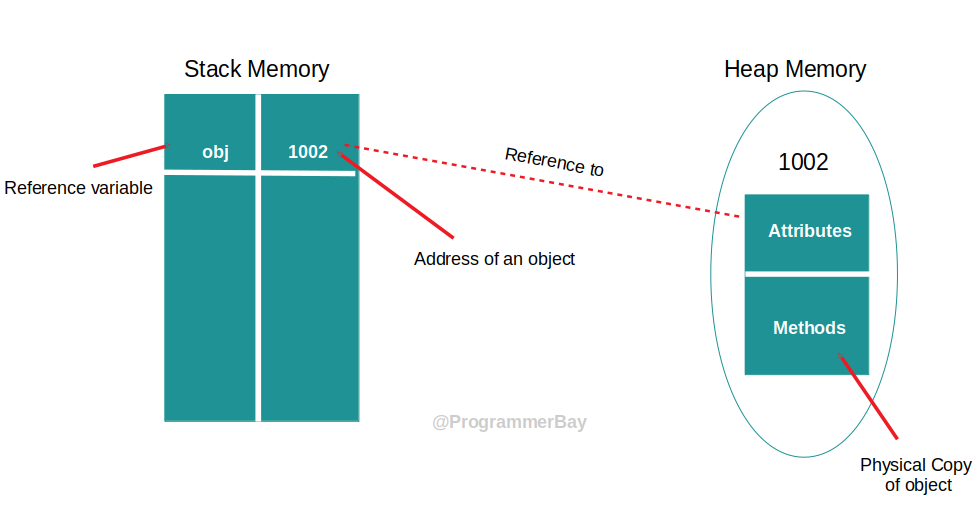
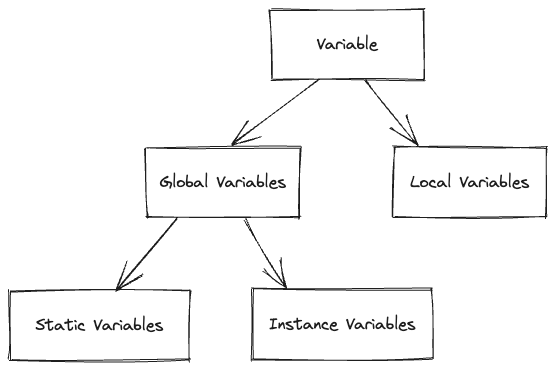

# Java SE

## What is Java?

- High Level Programming
- Object Oriented
- Strong Type Programming
- Write Once Run AnyWhere
- Desktop Applications
- Mobile Applications
- Enterprise Applications
- Embedded Applications
- Functional Style

## Writing Java


1. Source Code အားရေးသားခြင်း
2. Source Code အား compile လုပ်ခြင်း
3. Class file အား Java Virtual Machine(JVM) ပေါ်တွင် အလုပ်လုပ်စေခြင်း

## Write Once Run Anywhere


Java program တစ်ခုက JVM ရှိတဲ့ ဘယ် machine မှာမဆို အလုပ်လုပ်နိုင်ပါတယ်။

## Java Environment


## Java Editions

- Java SE
    - Java ဘာသာရပ်၏ အခြေခံ Edition
    - Desktop Application များအား ရေးသားနိုင်
- Java EE
    - Enterprise Java Application များအား ရေးသားရန် အခြေခံ Edition
- Java ME
    - Embedded ပတ်ဝန်းကျင်များ အတွက် Java Edition

## In This Course

- Java Basic
    - Language Fundamentals
        - Basic Structure of a Class
        - Java Data Types
        - Identifiers and Modifiers
        - Statements
    - OOP
        - OOP
        - Class & Interfaces
        - Enum & Annotations
        - Generics
    - Essential API
        - Exceptions
        - Numbers
        - Strings
        - Date & Calendar
        - Collections
        - Java IO
        - Nio 2
        - Threads
        - Concurrency
    - Functional Style
        - Lambda Expression
        - Streams API
        - Functional Programming
        - Functional Interfaces
- Database
    - Relational Database
    - Data Modeling
    - Simple SQL
    - JDBC API
- GUI
    - Scene Graph
    - Layouts
    - Controls
    - Styles and Effects
    - Animations

## Basic Structure of a Class

### Write A Class

class တွေကနေ တစ်ဆင့် object တွေကို တည်ဆောင်ဖို့ class တွေကို ရေးသားတာဖြစ်ပါတယ်။

### Components

- Package statements
- Import statements
- Comments
- Class declaration {\
  &nbsp; &nbsp; &nbsp; &nbsp;Variables\
  &nbsp; &nbsp; &nbsp; &nbsp;Comments\
  &nbsp; &nbsp; &nbsp; &nbsp;Constructors\
  &nbsp; &nbsp; &nbsp; &nbsp;Methods\
  &nbsp; &nbsp; &nbsp; &nbsp;Nested classes\
  &nbsp; &nbsp; &nbsp; &nbsp;Nested Interface\
  &nbsp; &nbsp; &nbsp; &nbsp;Enum\
  \}

## Class Declaration

class declaration components

|    Name    |    Descriptions     |   Status   |
|:----------:|:-------------------:|:----------:|
|   public   |   Access modifier   |  Optional  |
|   final    | Non-Access modifier |  Optional  |
|   class    |    Keyword class    | Compulsory |
|   Runner   |    Name of class    | Compulsory |
|  extends   |   Keyword extends   |  Optional  |
|  Persons   |   Base class name   |  Optional  |
| implements | Keyword implements  |  Optional  |
|  Athlete   | Name of implements  |  Optional  |
|     {}     |    Curly braces     | Compulsory |

## Running a Java Program

Java program တွေကို run မယ်ဆိုရင် `java` ဆိုတဲ့ command ကို သုံးပြီးတော့ run လို့ရပါတယ်။

```java
public class Person {
    public static void main(String[] args) {
        System.out.println("Hello World!");
    }
}
```

program ထဲမှာ run စေချင်တဲ့ code တွေကို main method ထဲမှာ ရေးရပါမယ်။

### How does work Args?

main method ထဲမှာပါလာတဲ့ args သည် java program ကို run တဲ့ အချိန်မှာ parameter အနေနဲ့ ပေးလိုက်တဲ့ value တွေကို args ကနေ
ပြန်ယူနိုင်ပါတယ်။

```java
public class Person {
    public static void main(String[] args) {
        for (String s : args) {
            System.out.println(s);
        }
    }
}
```

```bash
javac Person.java
java Person Hello
```

ဒီနေရာမှာဆိုရင် hello ဆိုတဲ့ command သည် args သို့ value အဖြစ်နဲ့ ပေးတာဖြစ်ပါတယ်။

```bash
java Person Hello World
```

ဒီနေရာမှာဆိုရင်တော့ Hello World သည် line တစ်ခုစီဖြင့်ထွက်လာမှာပဲ ဖြစ်ပါတယ်။ ဘာဖြစ်လို့လဲ ဆိုတော့ Hello နဲ့ World ဆိုတဲ့
command နှစ်ခုကြားမှာ space ပါနေတဲ့အတွက်ကြောင့် command နှစ်ခုလို့ သတ်မှတ်တာဖြစ်တဲ့အတွက်ကြောင့် Hello အသည် line 1
နေရာမှာပေါ်ပြီးတော့ World အသည် line 2 ဖြင့် ဖေါ်ပြမှာပဲ ဖြစ်ပါတယ်။

```bash
java Person "Hello World"
```

ဒီလိုရေးမယ်ဆိုရင်တော့ "Hello World" သည် line တစ်ခုတည်းဖြင့်ထွက်လာမှာပဲ ဖြစ်ပါတယ်။ "" double quote ပါနေတဲ့အတွက်ကြောင့်
string ဖြစ်သတ်မှတ်ပြီးတော့ စာကြောင်းတစ်ကြောင့်တည်းမှာပဲ လာဖော်ပြတာပဲ ဖြစ်ပါတယ်။

## Creating Objects from a Class

class ဟာ object တွေကို တည်ဆောက်ဖို့ပဲ ဖြစ်ပါတယ်။ object တစ်ခုမှာ အဓိကအားဖြင့်ဘာတွေပါလဲ ဆိုရင်တော့

- State
- Behaviour

ဆိုတဲ့ object ရဲ့ state ဖြစ်တဲ့ ပိုင်ဆိုင်မှု နဲ့ behaviour ဖြစ်တဲ့ အပြုအမူတို့ပါရှိပါတယ်။ State တွေဖြစ်တဲ့ variable
တွေကို ရေးနိုင်ပါတယ်။ behaviour ဖြစ်တဲ့ methods တွေကို လည်း ရေးနိုင်ပါတယ်။

```java
class Student {
    // State
    String name;
    int age;

    // behaviour
    void greet() {
        System.out.println("My name is " + name);
        System.out.println("My age is " + age);
    }
}
```

ဒီအဆင့်မှာဆိုရင် Student ဆိုတဲ့ class တစ်ခုကို ဆောက်လိုက်ပါတယ်။ အဲ့ class ကနေမှာ object တစ်ခုကို
တည်ဆောက်ဖို့လိုအပ်ပါတယ်။
class တစ်ခုကနေ object တည်ဆောက်တဲ့ အခါမှာ new ဆိုတဲ့ keyword ကိုသုံးပြီးတော့ တည်ဆောက်ရပါတယ်။
ထို့ကြောင့်

```java
public class Person {
    public static void main(String[] args) {
        Student aung = new Student();
    }
}

class Student {
    // State
    String name;
    int age;

    // behaviour
    void greet() {
        System.out.println("My name is " + name);
        System.out.println("My age is " + age);
    }
}
```

ဒီအဆင့်မှာဆိုရင်တော့ aung ဆိုတဲ့ Student object တစ်ခုကို တည်ဆောက်လို့ပြီးသွားပြီပဲဖြစ်ပါတယ်။ aung ရဲ့ အရှေ့မှာပါတဲ့
Student သည် object ရဲ့ အမျိုးအစားပဲဖြစ်ပါတယ်။ aung ဆိုတဲ့ object
ထဲမှာရှိတဲ့ name နှင့် age ကို ပြောင်းခြင်ရင်တော့ ယခုလိုပြောင်းရပါတယ်။

```java
public class Person {
    public static void main(String[] args) {
        Student aung = new Student();
        aung.name = "Aung Aung";
        aung.age = 20;
    }
}

class Student {
    // State
    String name;
    int age;

    // behaviour
    void greet() {
        System.out.println("My name is " + name);
        System.out.println("My age is " + age);
    }
}
```

aung ဆိုတဲ့ Student object ထဲမှာရှိတဲ့ behaviour ကို ပြန်သုံးချင်ရင်တော့ `aung.greet()` ဆိုပြီးတော့ ယခုလိုသုံးရပါတယ်။

```java
public class Person {
    public static void main(String[] args) {
        Student aung = new Student();
        aung.name = "Aung Aung";
        aung.age = 20;

        aung.greet();
    }
}

class Student {
    // State
    String name;
    int age;

    // behaviour
    void greet() {
        System.out.println("My name is " + name);
        System.out.println("My age is " + age);
    }
}
```

Student class ထဲမှာရှိတဲ့ greet ဆိုတဲ့ behaviour (method) ကိုပြန်ခေါ်သုံးပေးရတာပဲဖြစ်ပါတယ်။

```bash
javac Person.java
java Person
```

result ကိုတော့ ယခုလိုပဲ မြင်တွေ့ရမှာဖြစ်ပါတယ်။

```text
My name is Aung Aung
My age is 20
```

object ထဲက state တွေကို ပြောင်းလိုက်မယ်ဆိုရင် ၎င်း object ရဲ့ behaviour တွေကလည်း ပြောင်းသွားဆိုတာကိုလည်း သိထားရပါမယ်။
class တစ်ခုကနေ object တစ်ခုကို ဘယ်နှစ်ခုဆောက်လို့ရသလဲ
ဆိုရင်တော့ new keyword ခေါ်လိုက်တိုင်း ပြန်ဆောက်လို့ရပါတယ်။

```java
public class Person {
    public static void main(String[] args) {
        Student aung = new Student();
        aung.name = "Aung Aung";
        aung.age = 20;

        Student maung = new Student();
        maung.name = "Maung Maung";
        maung.age = 25;

        maung.greet();
        aung.greet();
    }
}

class Student {
    String name;
    int age;

    void greet() {
        System.out.println("My name is " + name);
        System.out.println("My age is " + age);
    }
}
```

java file တွေကို တစ်ခါပြောင်းပြီးလို့ result ကြည့်ချင်တိုင်းမှာ တစ်ကြိမ်ထပ်ပြီးတော့ compile လုပ်ပေးရပါတယ်။

```bash
javac Person.java
java Person
```

result ကိုတော့ ယခုလိုမြင်တွေ့ရမှာပဲ ဖြစ်ပါတယ်။

```text
My name is Maung Maung
My age is 25
My name is Aung Aung
My age is 20
```

ဒီနေရာမှာဆိုရင် aung ဆိုတဲ့ object ကို အရင် create လုပ်တာဖြစ်ပေမယ့်လည်း maung ဆိုတဲ့ object ကဘာဖြစ်လို့
အရင်ထွက်လာရတာလဲဆိုရင်တော့ `maung.greet()` ဖြစ်တဲ့ maung ရဲ့ method ကို အရင် သုံးထားလို့ပဲ ဖြစ်ပါတယ်။ ဒီ result
ကိုကြည့်မယ်ဆိုရင် maung နှင့် aung ရဲ့ object တွေဟာ သူတို့ရဲ့ state တွေပေါ်မှာ မူတည်ပြီးတော့ သူတို့ရဲ့
အလုပ်လုပ်ပုံတွေကလည်း မတူဘူးဆိုတာကို မြင်တွေ့ရမှာပဲ ဖြစ်ပါတယ်။

## Creating and Using Variable

Java မှာတော့ Data တွေနဲ့ Logic တွေဖြစ်တဲ့ function တွေကို object ဆိုတဲ့ unit တစ်ခုမှာ သိမ်းပြီးတော့ အသုံးပြုပါတယ်။
object တွေရဲ့ လက်ရှိအနေအထား state တွေကို ဖော်ပြဖို့အတွက် variable တွေကို အသုံးပြုပါတယ်။

variable တစ်ခုကို စပြီးတော့ declare လုပ်တော့မယ်ဆိုရင် variable type နဲ့ variable name ကိုတွဲပြီးတော့ declare
လုပ်ရပါတယ်။ variable ကို declare လုပ်တော့မယ်ဆိုရင် ယခုလိုပဲ လုပ်ရပါတယ်။

```java
class Student {
    String name;
    int age;
}
```

variable တွေကို assign လုပ်ချင်ရင်တော့ name နှင့် age သည် object တွေရဲ့ state တွေဖြစ် အတွက်ကြောင့် object
တွေကနေတစ်ဆင့် ပြန်ပြီးတော့ assign လုပ်ပေးရမှာပဲဖြစ်ပါတယ်။

```java
public class Person {
    public static void main(String[] args) {
        Student aung = new Student();
    }
}

class Student {
    String name;
    int age;
}
```

ဒီအဆင့်မှာဆိုရင်လည်း `Student aung` သည် variable တစ်ခုပဲဖြစ်ပါတယ်။ variable တွေကို assign လုပ်ချင်တဲ့အတွက်ကြောင့်
aung ဆိုတဲ့ student object တစ်ခုကို အရင် create လုပ်ပါတယ်။ `Student aung = new Student()` ဒီလိုမျိုး object တစ်ခု
create လုပ်ပြီးတာနဲ့ တစ်ပြိုင်နက် JVM က ဘယ်လိုအလုပ်လုပ်သလဲ ဆိုရင် **Stack memory** မှာ aung ဆိုတဲ့ နာမည်နဲ့ variable
တစ်ခုကို create လုပ်လိုက်ပါတယ်။ သူရဲ့ type ကတော့ student ဖြစ်ပါတယ်ဆိုပြီးတော့ variable တစ်ခုကို တည်ဆောက်လိုက်ပါတယ်။
ပြီးတော့မှာ **Heap memory** ပေါ်မှာ `new Student()` ဆိုတဲ့ object ကို evalute လုပ်ပြီးတော့ ၎င်းရဲ့ heap address ကို
ခုနက create လုပ်ထားတဲ့ **Stack memory** ပေါ်မှာရှိတဲ့ aung ဆိုတဲ့ variable မှာ သိမ်းပါတယ်။



ဒါကြောင့် ၎င်း variable type တွေကို reference variable တွေလို့ခေါ်ပါတယ်။

```java
public class Person {
    public static void main(String[] args) {
        Student aung = new Student();
        aung.name = "Aung Aung";
        aung.age = 20;

        Student maung = new Student();
        maung.name = "Maung Maung";
        maung.age = 25;

        maung.greet();
        aung.greet();
    }
}

class Student {
    String name;
    int age;

    void greet() {
        System.out.println("My name is " + name);
        System.out.println("My age is " + age);
    }
}
```

ဒီအဆင့်မှာဆိုရင် aung ဆို variable တစ်ခုကို create လုပ်တယ်။ ပြီးတော့ maung ဆိုတဲ့ variable တစ်ခုကို create လုပ်တယ်။
variable တွေက မတူညီတဲ့ အတွက် သူတို့တွေရဲ့ state တွေလည်း သီခြားဖြစ်နေပါလိမ့်မယ်။

## Variable Scope



Variable တွေ declare လုပ်ထားတဲ့ နေရာပေါ်မူတည်ပြီးတော့ scope တွေလည်း ကွဲခြားပါတယ်။ scope တွေအပေါ်မူတည်ပြီးတော့ variable
တွေရဲ့ အသုံးပြုနိုင်တဲ့ အတိုင်းအတာတွေလည်း ကွဲပြားပါတယ်။ scope တွေပေါ်မူတည်ပြီးတော့ variable တွေကို
အမျိုးအစားနှစ်မျိုးခွဲနိုင်ပါတယ်။

- Global Variables
    - Static Variables
    - Instance Variables
- Local Variables

## Global Variables

- Java ဘာသာရပ်တွင် Declare လုပ်ထားသော နေရာ တွင်မူတည်ပြီး Variable များ၏ အသုံးပြုနိုင်တဲ့ နေရာတွေသည်လည်း ကွာခြားပါသည်
- Class Body အောက်တည့်တည့်တွင် Declare လုပ်ထားသော Variable များသည် Class သို့မဟုတ် Object တစ်ခု JVM အပေါ်တွင်
  တည်ရှိနေသည့် ကာလ အတွင်း အဆိုပါ Variable သည်လဲ တည်ရှိနေပါမည်
- အဆိုပါ Variable များအား Global Variable ဟုခေါ်ပါသည်
- Global Variable များအား Class အတွင်းရှိ မည်သည် Block များမှ မဆို အသုံးပြုနိုင်မည် ဖြစ်သည်
- Global Variable များအား အသုံးလိုသည့် အမျိုးအစား အပေါ်မူတည်ပြီး Static Variable နှင့် Instance Variable ဟု
  ခွဲခြားနိုင်ပါသည်

```java
public class Variable {
    int data; // Instance Variable | Object Variable
    static int COUNT; // Static Variable
    private int privteInt;
    static final int FINAL_INT = 10;
}
```

Global Variable များအား တန်ဖိုးသတ်မှတ်ထားခြင်းမရှိပါက Compiler မှ Default တန်ဖိုးကို သတ်မှတ်ပေးပါမည်။

### Instance Variable or Object Variable

```java
public class CounterTest {
    public static void main(String[] args) {
        Counter c1 = new Counter();
        c1.countUp();

        Counter c2 = new Counter();
        c2.countUp();

        System.out.println("C1 Count is " + c1.count);
        System.out.println("C2 Count is " + c2.count);
    }
}

class Counter {
    int count;


    public void countUp() {
        count++;
    }
}
```

Result

```text
C1 Count is 1
C2 Count is 1
```

Datatype ရဲ့ အရှေ့မှာ ဘာမှ မရေးထားရင် ၎င်း variable တွေသည် object
တွေရဲ့ state တွေကို ဖော်ပြနိုင်တဲ့အတွက်ကြောင့်
Instance Variable ဒါမှမဟုတ် Object Variable လို့ခေါ်ပါတယ်။ Instance Variable တွေဟာ object တစ်ခုချင်စီနဲ့သာ
သက်ဆိုင်ပါတယ်။

### Static Variable

```java
public class CounterTest {
    public static void main(String[] args) {
        Counter c1 = new Counter();
        c1.countUp();

        Counter c2 = new Counter();
        c2.countUp();

        System.out.println("C1 Count is " + c1.count);
        System.out.println("C2 Count is " + c2.count);
    }
}

class Counter {
    static int count;


    public void countUp() {
        count++;
    }
}
```

Result

```text
C1 Count is 2
C2 Count is 2
```

Datatype ရဲ့ အရှေ့မှာ static keyword ရေးထားတဲ့ အတွက်ကြောင့် ၎င်း variable သည် object variable အနေနဲ့ အသုံးမပြုပဲ class
ထဲမှာပဲ အသုံးပြုတဲ့အတွက်ကြောင့် Static Variable လို့ခေါ်ပါတယ်။ Static Variable တွေဟာ class များနှင့်သာ သက်ဆိုင်တဲ့
အတွက်ကြောင့် Class Variable တွေလို့လည်း ခေါ်ပါတယ်။ Object ဆောက်ရာတွင် static variable များအား copy
ယူသွားခြင်းမရှိသောကြောင့် static variable တွေဟာ application တစ်ခုလုံးမှာ တစ်ခုတည်းသာရှိပါတယ်။

## Local Variable

- Class တစ်ခု၏ method ဒါမှမဟုတ် Block တစ်ခုခု အတွင်းတွင် Declare လုပ်ထားသော Variable များသည် ၎င်းတို့ကို Declare
  လုပ်ထားသော နေရာမှ လက်ရှိ Block ၏ နောက်ဆုံးနေရာအထိသာ အသုံးပြုနိုင်သည်။
- ထိုကဲ့သို့ Variable များကို Local Variable ဟုခေါ်ပါသည်။
- Local Variable များအား Compiler မှ Default တန်ဖိုးများကို ဖြည့်စွက်ပေးနိုင်ခြင်းမရှိသောကြောင့် အသုံးမပြုခင်
  တန်ဖိုးတစ်ခုခုကို Assign လုပ်ပေးရန်လိုအပ်ပါသည်။
- Local Variable များအား Local Scope အတွင်း ယာယီတန်ဖိုးများအား မှတ်သားထားထားရန် အသုံးပြုပါသည်။
- Local Variable တွေကို scope တစ်ခုတည်းမှာ variable name တွေတူနေလို့ မရပါဘူး။ scope မတူရင်တော့ ရေးလို့ရပါတယ်။

```java
public class LocalVariableTest {

    static String message = "Global Variable";

    public static void showMessage(String message) {
        System.out.println(message);
    }

    public static void doSomething() {
        String message = "Do Something";
        System.out.println(message);
    }

    public static void main(String[] args) {
        doSomething();
    }
}
```

Result

```text
Do Something
```

ဒီနေရာမှာ `Do Something` အဖြေထွက်ချင်းသည် ၎င်း scope ထဲမှာရှိတဲ့ variable ကိုပဲ ဦးစားပေးပြီးတော့
ယူသွားတာဖြစ်တဲ့အတွက်ကြောင့်ပဲ ဖြစ်ပါတယ်။ အဲ့ဒါဆိုရင် global variable ကို ပြန်ခေါ်သုံးချင်ရင် ဘယ်လိုခေါ်မလဲ -

```java
public class LocalVariableTest {

    static String message = "Global Variable";

    public static void showMessage(String message) {
        System.out.println(message);
    }

    public static void doSomething() {
        String message = "Do Something";
        System.out.println(LocalVariableTest.message);
    }

    public static void main(String[] args) {
        doSomething();
    }
}
```

Result

```text
Global Variable
```

Static Variable တွေကို ပြန်ခေါ်သုံးမယ်ဆိုရင်တော့ ၎င်း variable ရဲ့ owner ကိုသတ်မှတ်ပေးပြီးတော့ `.` ခံပြီးတော့ ၎င်း
variable ကို ပြန်ခေါ်သုံးပေးရမှာပဲ
ဖြစ်ပါတယ်။ `LocalVariableTest.message`ဆိုပြီးတော့ ပြန်ခေါ်သုံးပေးရမှာပဲ ဖြစ်ပါတယ်။ Local variable နဲ့ Global variable
နှစ်ခုကို နာမည်တူပေးခဲ့ရင် Local Variable ရဲ့ တန်ဖိုးက Global Variable ရဲ့ တန်ဖိုးကို ဖုံးကွယ်စေနိုင်ပါတယ်။
ထိုကဲ့သိုဖြစ်တာကို **Variable Hiding** ဖြစ်တယ်လို့ခေါ်ပါတယ်။

```java
public class LocalVariableTest {

    String message = "Global Variable";

    public void showMessage(String message) {
        System.out.println(message);
    }

    public void doSomething() {
        String message = "Do Something";
        System.out.println(this.message);
    }

    public static void main(String[] args) {
        LocalVariableTest obj = new LocalVariableTest();
        obj.doSomething();
    }
}
```

Result

```text
Global Variable
```

Instance Variable & Object Variable တွေကို ပြန်ခေါ်သုံးမယ်ဆိုရင်တော့ ၎င်း object ရဲ့ owner ကို reference လုပ်တဲ့ `this`
keyword ကို သုံးပြီးတော့ `this.message` ဆိုပြီတော့ ပြန်သုံးပေးရမှာပဲဖြစ်ပါတယ်။

## Methods

- Method များအား၊ အသုံးချလုပ်ဆောင်ချက်များနှင့် Object တွေရဲ့ Behaviour များအား ဖော်ပြရာတွင် အသုံးပြုပါသည်။
- Method တစ်ခုအား ရေးရာတွင် အောက်ပါအချက်များအား စဥ်းစားထားရပါမည်။
    - ထို Method အား အသုံးပြု၍ ဘာပြန်ရနိုင်သလဲ (Return Type)
    - Method အား အလုပ်လုပ်စေရန် ဘာပေးရမှာလဲ။ (Arguments)

### Writing Method

```java
public static void main(String[]args){}
```

|  Name  |     Description     |
|:------:|:-------------------:|
| public |   Access Modifier   |
| static | Non-Access Modifier |
|  void  |     Return type     |
|  main  |     Method Name     |
| String |      Arguments      |
|  args  |     Method Body     |

- Method များတွင် Return Type အား ရေးသားထားပါက Method Body ၏ နောက်ဆုံးတွင် Type တူသော တန်ဖိုးတစ်ခုအား Return လုပ်ရမည်။
- Return လုပ်ရန် မလိုအပ်သော Method များဆိုပါက၊ Return Type နေရာတွင် void ဟုရေးသားရပါမည်။
- Argument များလည် မလိုအပ်ပါက () ကိုသာ ရေးသားရပါမည်။

```java
public class MethodTest {
    public static void main(String[] args) {
        showAddResult(1, 1);
        sayHello();
        System.out.println(add(1, 4));
    }

    static void showAddResult(int a, int b) {
        System.out.println(a + b);
    }

    static void sayHello() {
        System.out.println("Hello");
    }

    static int add(int a, int b) {
        return a + b;
    }
}
```

## Type of Methods

- Instance Method
- Static Method

### Static Method

```java
public class MethodTest {
    public static void main(String[] args) {
        sayHello();
        showAddResult(10, 50);

        int result = add(10, 10);
        System.out.println(result);

        OtherMethod.showMessage("Using Other Methods.");
    }

    static void showAddResult(int a, int b) {
        System.out.println(a + b);
    }

    static void sayHello() {
        System.out.println("Hello");
    }

    static int add(int a, int b) {
        return a + b;
    }
}
```

static method တွေကို ဘာဖြစ်လို့ ရေးရတာလဲ ဆိုရင် mian ဆိုတဲ့ method ကနေပြန်ခေါ်သုံးချင်လို့ပဲ ဖြစ်ပါတယ်။ main သည်လည်း
static method ဖြစ်တဲ့အတွက်ကြောင့် static method ကနေပြီးတော့ ပြန်ခေါ်သုံးလို့ရတာတွေသည် static method တွေကိုပဲ
ပြန်ခေါ်သုံးလို့ရတဲ့ အတွက်ကြောင့်ပဲ ဖြစ်ပါတယ်။ static method က instance methods တွေကို ခေါ်သုံးလို့မရသလို instance
variable တွေကိုလည်း Access လုပ်လို့မရပါဘူး။ static method တွေသည် object တွေနဲ့ပဲ ဆိုင်ပါတယ်။

### Instance Method

static keyword မပါတာတွေသည် instance method တွေဖြစ်ကြပါတယ်။ Method တွေရေးတဲ့ အခါမှာ object တွေရဲ့ state တွေကို
ပြန်ပြီးတော့ access လုပ်စရာလိုတယ်ဆိုရင်တော့ Instance Method တွေကို အသုံးပြုရပါမယ်။ Instance Method တွေကတော့ Instance
Methods, Instance Variable, Static Methods and Static Variable တွေအားလုံးကို Access လုပ်လို့ရပါတယ်။

## Method Overloading

Variable တွေရဲ့ Identifier နာမည်တွေနဲ့ JVM နဲ့ Compiler က ပြန်ပြီးတော့ Identify လုပ်ပါတယ်။ အဲ့ဒါကြောင့် scope တူတဲ့
နာမည်တူတဲ့ variable နှစ်ခုကို ရေးလို့မရပါဘူး။ scope မတူရင်တော့ နာမည်တူတဲ့ variable နှစ်ခုကို ရေးလို့ရပါတယ်။
အဲ့အခါမှာတော့ global scope ထဲမှာရှိတဲ့ variable ကို local scope ထဲမှာရှိတဲ့ variable က hide လုပ်သွားပြီတော့ Variable
Hiding ဖြစ်စေနိုင်ပါတယ်။ JVM နဲ့ Compiler က method တစ်ခုဖြစ်ပါတယ်ဆိုတာကို method name နဲ့ သူနဲ့ပါလာတဲ့ argument list ကို
ကြည့်ပြီးတော့ method တစ်ခုဖြစ်ပါတယ်လို့ သတ်မှတ်ပါတယ်။ နာမည်တူပြီးတော့ argument မတူနဲ့ method တွေကို java မှာ
ရေးလို့ရပါတယ်။ Java Compiler နဲ့ JVM က argument type တွေကိုပဲ ကြည့်ပြီးတော့ ဆုံးဖြတ်တာပဲ ဖြစ်ပါတယ်။

```java
public class SameNameMethods {
    public static void main(String[] args) {
    }

    static void method1() {
    }

    static void method1(int i) {
    }
}
```

Method နဲ့ Argument List ကို ဖော်ပြတဲ့အရာကို java မှာ Method signature လို့ ခေါ်ပါတယ်။ နာမည်တူပြီး argument မတူတဲ့
method ရေးသားနည်းကို java မှာ method overloading လို့ခေါ်ပါတယ်။

## Constructors

### Write

- Constructor များသည် Object ဆောက်သည့် အခါတွင် အသုံးပြုမည့် Special Method တစ်မျိုး
- Constructor အမည်ကို Class အမည်နဲ့ ထပ်တူ ရေးသားရမည်
- Argument တွေကို မရေးသားပဲ နေနိုင်သလို၊ လိုအပ်ပါက ရေးသားနိုင်ပါသည်
- Return Type အား ရေးသားရန်မလိုအပ်ပါ

### Default Constructor

- အကယ်၍ Class တစ်ခုအတွင်းတွင် Constructor အား ရေးသားထားခြင်းမရှိပါက၊ compiler မှ အလိုလျှောက် Default Constructor အား
  ဖြည့်စွက်ပေးမည် ဖြစ်ပါသည်။
- အကယ်၍ Class အတွင်းတွင် Constructor တစ်ခုအား ရေးသားထားပါက Default Constructor အား အသုံးပြုနိုင်တော့မည် မဟုတ်ပေ။
- Argument ပါတဲ့ Constructor ကို ရေးသားလိုက်တဲ့အခါမှာ Default Constructor ကို ဖုံးကွယ်စေတဲ့အတွက် Argument မပါတဲ့
  Constructor ကို အသုံးပြုလိုပါက ဖြည့်စွက်ရေးသားရန် လိုအပ်ပါသည်။

Constructor တွေသည် object တွေရဲ့ instance variable တွေကို initialize လုပ်ပေးနိုင်ပါတယ်။

- Car.java

```java
public class Car {
    String type;
    String model;

    Car(String type, String model) {
        this.type = type;
        this.model = model;
    }

    void showInfo() {
        System.out.println("Type : " + type);
        System.out.println("Model : " + model);
    }
}
```

- CarTest.java

```java
public class CarTest {
    static public void main(String[] args) {
        Car car = new Car("Caldina", "2016");
        car.showInfo();
    }
}
```

Constructor Overwriting

```java
public class Car {
    String type;
    String model;

    Car(String type, String model) {
        this.type = type;
        this.model = model;
    }

    Car(String str, boolean isType) {
        if (isType) {
            this.type = str;
        } else {
            this.model = str;
        }
    }

    Car() {
    }


    void showInfo() {
        System.out.println("Type : " + type);
        System.out.println("Model : " + model);
    }
}
```

## Packages

- File System ထဲမှာရှိတဲ့ Directory နဲ့ သဘောထားချင်းတူပါတယ်။
- အမည်တူသော Class များအား **Package** သုံးပြီးတော့ ကွဲပြားအောင်လုပ်နိုင်ပါတယ်။
- လုပ်ဆောင်မှုအလိုက် **Package** ကို အသုံးပြုပြီးတော့ တစ်နေရာတည်းမှာ စုစည်းပေးနိုင်ပါတယ်။

> [day-03/com/jdc/teaching/Course.java](./day-03/com/jdc/teaching/Course.java)

```java
package com.jdc.teaching;

public class Course {
}
```

> [day-03/com/jdc/registration/Student.java](./day-03/com/jdc/registration/Student.java)

```java
package com.jdc.registration;

public class Student {
}
```